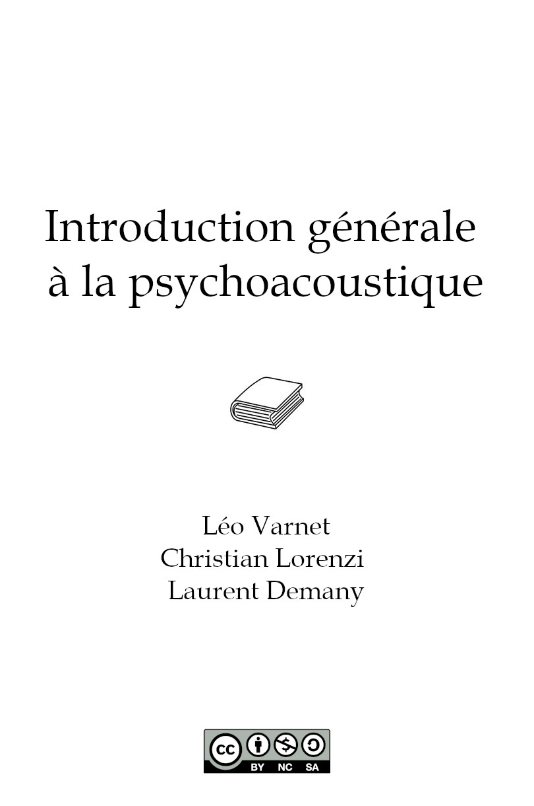

{::comment}





{:/comment}

**Introduction générale à la psychoacoustique**

*Léo Varnet, Christian Lorenzi, Laurent Demany*

Ce manuel a pour vocation de présenter une vue globale de la psychoacoustique, la science qui explore la manière dont le système auditif humain perçoit et interprète les sons qui nous entourent. Il s'adresse aux étudiant·e·s en psychologie, ingénieur·e·s du son, musicien·ne·s ou simplement à toute personne passionnée par le monde de l'audio. Dans les deux premiers chapitres, nous présenterons [les bases de la méthodologie psychophysique](01.html) ainsi que son cadre mathématique, [la théorie de la détection du signal](02.html). Au moyen de ces outils, nous étudierons les mécanismes qui régissent notre perception de caractéristiques simples des sons : l'intensité, la hauteur tonale, le timbre, et la localisation. Ceci nous permettra ensuite de comprendre comment notre cerveau sépare et organise les sons que nous entendons en sources sonores distinctes, un processus appelé Analyse de Scènes Auditives. Dans un second temps, nous nous intéresserons à un type de stimuli sonores particulier, extrêmement utile pour les humains : les sons de parole. Nous verrons comment les phonèmes, unités de base du langage oral, sont décodés par le cerveau, avant de nous pencher sur le traitement d'unités plus longues tels que les mots et les phrases.

Cet ouvrage est publié sous une licence [CC-BY-NC-SA](https://creativecommons.org/licenses/by-nc-sa/4.0/). Si vous remarquez une erreur, n'hésitez pas à la signaler sur la [page GitHub](https://github.com/LeoVarnet/psychoacoustique) de cette ressource éducative ouverte.

**Sommaire**

1. [Les bases de la méthodologie psychophysique](01.html)
2. [La théorie de la détection du signal](02.html)
3. Perception de l'intensité sonore
4. Perception de la hauteur tonale
5. Perception du timbre
6. Audition binaurale et localisation auditive
7. Analyse de Scènes Auditives
8. Phonétique expérimentale
9. Perception de la parole continue
10. D'autres chapitres...